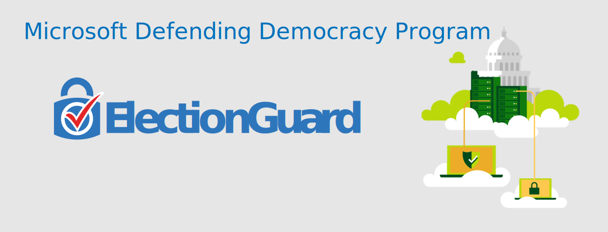

# 🗳 ElectionGuard

ElectionGuard is an open source software development kit (SDK) that makes voting more secure, transparent and accessible. The ElectionGuard SDK leverages [homomorphic encryption](https://en.wikipedia.org/wiki/Homomorphic_encryption) to ensure that votes recorded by electronic systems of any type remain encrypted, secure, and secret. Meanwhile, ElectionGuard also allows verifiable and accurate tallying of ballots by any 3rd party organization without compromising secrecy or security. 

Announced on May 6th at the Build developer conference, ElectionGuard will enable end-to-end verification of elections as well as support the publication of results from ballot comparison audits.  Results can be published online or made available to third-party organizations for secure validation, and allow individual voters to confirm their votes were correctly counted. 
 
Read more in [the announcement blog post](https://blogs.microsoft.com/on-the-issues/?p=63211). 

## Open-Source
This library and all linked ElectionGuard projects, are licensed under the MIT license. There is no fee for using ElectionGuard.

## Core Component
This is the core SDK that performs election functions such as vote encryption, decryption, key generation, and tallying. This code is meant to be run on voting system hardware and to be integrated into existing (or new) voting system software. The ElectionGuard SDK is meant to add end-to-end verifiability and encryption into 3rd party comprehensive voting systems. There are provided simplistic, proof-of-concept applications to understand how each implementation of the API should be called. Currently, there are two available implementations.

### Python
[📁 Source](https://github.com/microsoft/electionguard-python) - https://github.com/microsoft/electionguard-python

:warning: The below repositories are deprecated. If you wish to do active development using the Electionguard API, please use the Python version. :warning:

### C

[📁 Source](https://github.com/microsoft/electionguard-c) - https://github.com/microsoft/electionguard-c

### C#
[📁 Source](https://github.com/microsoft/electionguard-dotnet) - https://github.com/microsoft/electionguard-dotnet

[📦 Package - ElectionGuard.SDK](https://www.nuget.org/packages/ElectionGuard.SDK)

## Specifications & Documentation
This library contains the fundamental specifications, documentation, architecture, and mathematical/cryptographic proofs that underpin ElectionGuard. If you're looking to understand the system better, or want to know how to integrate the various components, there is a lot of valuable information contained here.

[📄 Documentation and Specifications](https://github.com/microsoft/electionguard/wiki)

## Reference Implementation
The remainder of the ElectionGuard SDK consists of a reference implementation split over several separate repositories. These repos, although intended to be used together as components of a broader solution, can also stand alone if developers wish to only research or implement one component.

### Admin Device
This is an application used to administer ElectionGuard election processes, including key generation, trustee provisioning, and post-election tallying, partial decryptions, and zero-knowledge proofs.

[📁 Source](https://github.com/microsoft/electionguard-admin-device) - https://github.com/microsoft/electionguard-admin-device

### Ballot Box
This library is used to scan ballots to generate lists of cast and spoiled ballots in an election; used in tallying to finalize ballot operations (cast or spoil, etc.) for publishing results.

[📁 Source](https://github.com/microsoft/electionguard-ballot-box) - https://github.com/microsoft/electionguard-ballot-box

### Ballot Marking Device
This contains a working instance of ballot marking device (BMD). Built by VotingWorks in consultation with the [Center for Civic Design](https://civicdesign.org), this front-end provides an interface for a voter to complete and print a ballot which, in an end-to-end verifiable use case, would be accompanied by a printed tracking ID. This BMD front-end is provided as one, potential implementation.

[📁 Source](https://github.com/microsoft/electionguard-ballot-marking-device) - https://github.com/microsoft/electionguard-ballot-marking-device

### Tracking Site
An application that demonstrates publication of ElectionGuard election artifacts to a public website to enable verification ID lookup, downloadable zip files of the election result (for third-party verifiers), and election results summaries.

[📁 Source](https://github.com/microsoft/electionguard-tracking-site) - https://github.com/microsoft/electionguard-tracking-site

### Verifier
The verifier application is used to perform an external, independent verification of an election tally. This repository contains a reference implementation of a verifier built against the ElectionGuard specifications. This is not meant to be the *only* verifier application, but rather an example. This library should be used in tandem with the technical specifications and usage guidelines contained in the [specifications](https://github.com/microsoft/electionguard/wiki).

[📁 Source](https://github.com/microsoft/electionguard-verifier) - https://github.com/microsoft/electionguard-verifier

### Web API
This is an API that interacts with admin encrypter devices to perform ballot encryption, casting, spoiling, and tallying. This makes use of the C# Nuget package.

[📁 Source](https://github.com/microsoft/electionguard-web-api) - https://github.com/microsoft/electionguard-web-api

## Security Issues Reporting
We encourage the developer and security community to conduct research, report issues, and suggest improvements on this code base. However, unlike performance or feature bugs, please do **not** report security vulnerabilities in public Github comments. Each repository has a SECURITY file with instructions on responsibly reporting security vulnerabilities under Microsoft's CVD process.

 ## Contributing
Help defend democracy and **[contribute to the project][]**.

[Code of Conduct]: CODE_OF_CONDUCT.md
[Contribute to the project]: CONTRIBUTING.md

## Thanks! 🎉
A huge thank you to those who helped to contribute to this project so far, including:
* Josh Benaloh (whose [PhD thesis](https://www.microsoft.com/en-us/research/publication/verifiable-secret-ballot-elections/) was the genesis of much of this work)
* [Galois](https://galois.com/) / [Free & Fair](https://freeandfair.us/)
* [VotingWorks](https://voting.works/)
* [Center for Civic Design](https://civicdesign.org/)
* [Oxide Design](https://oxidedesign.com/)
* [InfernoRed Technology](https://infernored.com/)
* Many teams within Microsoft
 
