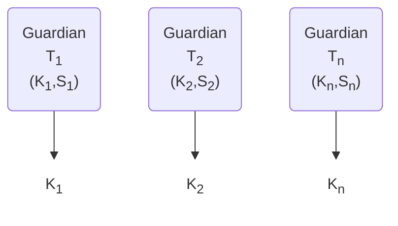
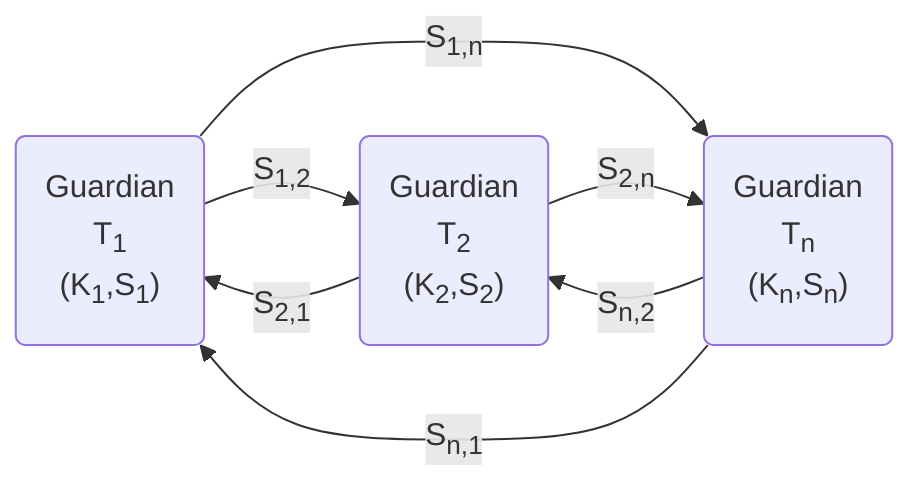
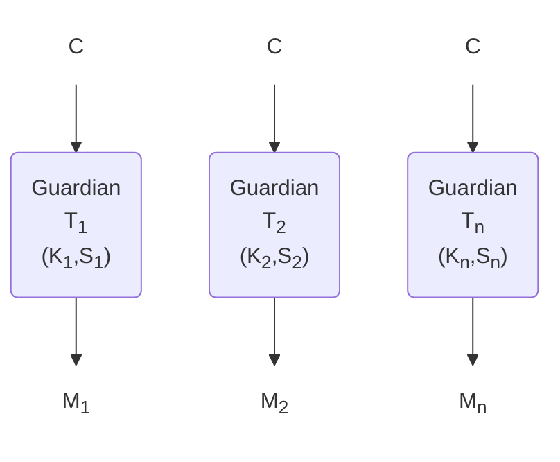
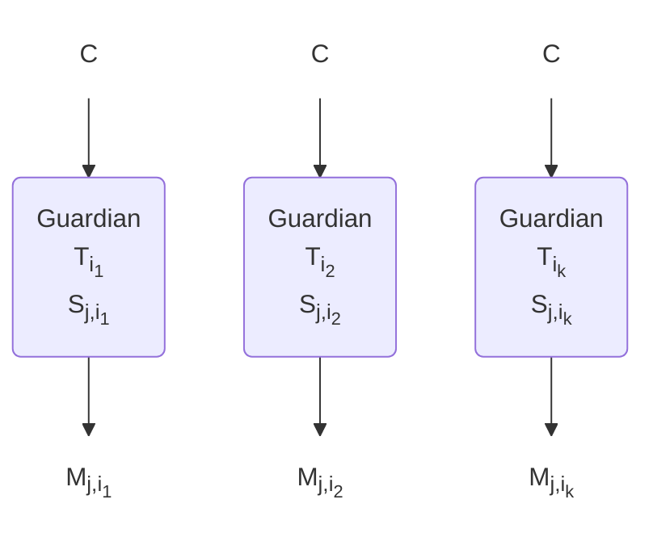
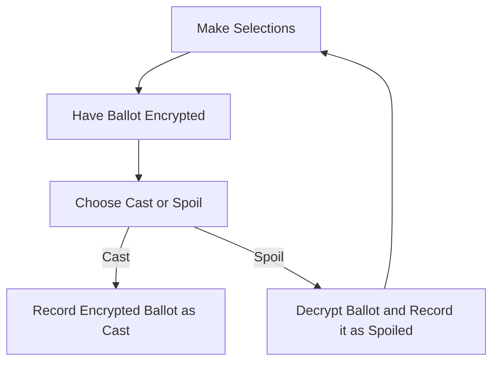

# Structure and Processes

ElectionGuard provides tools to enable end-to-end verifiable elections. This allows voters to check for themselves that their votes have been accurately counted.

The ElectionGuard process has three principal components.

- Pre-election key generation
- Ballot encryption
- Post-election decryption of tallies

## Pre-Election Key Generation

ElectionGuard utilizes Guardians to protect confidentiality of ballots. The Guardians independently generate public-private key pairs from public election parameters.

The individual public keys are then combined to form the election public key using simple multiplication.

$$
K=\prod_{i=1}^{n} K_i
$$

At this point in the process, the only way to decrypt data encrypted with the election public key K is for all n Guardians to individually apply their secret keys. This situation is fragile since a single missing Guardian will prevent an election from being completed. To remedy this, as the final pre-election step, the Guardians distribute to each other shares of their private keys. The sharing is done according to a pre-determined quorum parameter k and will allow any quorum set of k Guardians to complete a decryption.

## Balot Encryption

An encrypted ballot consists entirely of encryptions of zeros and ones.

A simple clear form ballot with a single contest might look something like the following.
  
$$
\braket{{\color{RoyalBlue} 0,1,0,0}}
$$  

This would represent a ballot with a single contest in which the second of four options has been selected.

The encrypted version of this ballot would consist of four encrypted values

$$
\braket{C_1,C_2,C_3,C_4}
$$
 
accompanied by "proofs" that each W_i is an encryption of either zero or one.

But this is not enough to show that an encrypted ballot represents a legitimate vote because the clear form might be as follows.
  
$$
\braket{{\color{RoyalBlue} 0,1,0,1}}
$$
  
The above ballot would indicate votes for both the second and fourth options, and this may not be allowed.

To address this, we use the *homomorphic* property of the encryption which allows us to combine encryptions to produce an encryption of the sum. By using simple encryption, we can form a new encrypted value as

$$
C=\prod_{i=1}^{4} C_i
$$

and include a proof that this W is an encryption of one to show that the ballot doesn’t include excessive votes.

### Placeholders

This isn’t quite everything we need, because a voter might choose to not vote in a contest. The resulting clear form of this ballot would look like the following.
  
$$
\braket{{\color{RoyalBlue} 0,0,0,0}}
$$
  
If we were to homomorphically combine values in an encrypted form of this ballot, we would get an encryption of zero – not an encryption of one. We wouldn’t want to reveal this fact, because even a voter who chooses not to vote deserves privacy.

To address this, we add a *placeholder* option to each contest that can be thought of as a "none of the above" vote. So a contest with four options would be typically be represented by a ballot with five positions – with the fifth option set to one if the voter selects none of the four options offered.

$$  
\braket{{\color{RoyalBlue} 0,0,0,0},{\color{SkyBlue} 1}}
$$
  

[Color changes are for exposition only.]

Internally, a placeholder option looks no different from an ordinary option. But we can now ensure that a homomorphic combination of all of the encryptions on a ballot will be one.

An encrypted ballot can now be shown to be legitimate by proving that each value is an encryption of either zero and one and the homomorphic combination of all of the encryptions in each contest is an encryption of one.
  
$$
\braket{{\color{RoyalBlue} 0,0,0,0},{\color{SkyBlue} 1}} \longrightarrow {\color{DarkBlue} 1}
$$
  
Some might recognize this as a "map-reduce" operation (or for those familiar with Kenneth Iverson's APL, a simple reduction operation). The operator applied to encrypted values is simple multiplication. But the effect is to produce an encryption of the sum of the clear form values.

### Selection Limits

There is one further generalization that must be accommodated. In some elections, there are contests where a voter is allowed to select more than one option. For example, there might be five options of which a voter is allowed to select up to three.

To accommodate this possibility, we note the *selection limit* for each contest and generalize the use of placeholders. In most elections, all or most contests will have a selection limit of one, and one placeholder option will be added to each such contest. However, if the selection limit is higher, additional placeholder values are added – with the total number of placeholders matching the selection limit.

For example, a "choose up to three of five" contest will be captured with eight encrypted values, the first five of which match the selections that can be made by a voter, and the last three of which are placeholder values that can be set if a voter does not make the maximum number of selections.

The following offers some examples of how the clear form of a choose three of five ballot might be set.
  
\begin{align}
    \braket{{\color{RoyalBlue} 1,0,0,1,1,}{\color{SkyBlue}0,0,0}} \longrightarrow {\color{DarkBlue}3} \\
    \braket{{\color{RoyalBlue} 0,1,1,0,1,}{\color{SkyBlue}0,0,0}} \longrightarrow {\color{DarkBlue}3} \\
    \braket{{\color{RoyalBlue} 1,0,0,1,0,}{\color{SkyBlue} 0,0,1}}\longrightarrow {\color{DarkBlue}3} \\
    \braket{{\color{RoyalBlue} 0,0,0,1,0,}{\color{SkyBlue} 0,1,1}} \longrightarrow {\color{DarkBlue}3} \\
    \braket{{\color{RoyalBlue}0,0,0,0,0,}{\color{SkyBlue} 1,1,1}} \longrightarrow {\color{DarkBlue}3} \\
\end{align}

[Color changes are for exposition only.]

The first two instance represent ballots in which all three allowed votes have been used; the next instance shows a ballot in which only two options were selected; the following ballot instance contains one selection (and two placeholders set); and the final instance shows a case when a voter has made no selections and all three placeholders are used.

In all of the above examples, an associated encrypted ballot is shown to be legitimate by showing that every value is an encryption of zero or one and the homomorphic combination of all of the encryptions produces an encryption of three.

### Write-in Votes

ElectionGuard currently does not distinguish between write-ins. If a write-in option is offered, ElectionGuard treats it as any other selection. ElectionGuard tallies the number of write-ins for any contest without indicating what was written in.

### Multiple Contests

Most elections consist of more than a single contest. A single ballot can therefore include multiple contests. An encrypted ballot still consists entirely of encryptions of zeros and ones, but the interpretation of these encryptions and the accompanying proofs depend upon details provided in the ballot manifest.
  
$$
\braket{{\color{RoyalBlue} 0,1,0,}{\color{SkyBlue} 0};{\color{ForestGreen} 1,0,}{\color{YellowGreen} 0};{\color{RoyalBlue} 0,0,}{\color{SkyBlue} 1};{\color{ForestGreen} 1,0,1,0,0,}{\color{YellowGreen} 0,0,1}}
$$
  

[Color changes are for exposition only.]

The above example shows a clear form of a ballot with four contests in which the second of three options is selected in the first contest (with the fourth position as an unused placeholder), the first of two options is chosen in the second contest (with the third position as an unused placeholder), neither of two options is selected in the third contest (with the placeholder set to one), and the first and third option selected in a "three of five" fourth contest with one of three placeholders set to one.

The encrypted form of the example above should be accompanied by proofs that all eighteen of the components are encryptions of zero or one, that the first four encryptions
homomorphically combine to form an encryption of one, the next three encryptions
homomorphically combine to form an encryption of one, the following three encryptions
homomorphically combine to form an encryption of one, and the final eight encryptions
homomorphically combine to form an encryption of three.

## Post-Election Decryption of Tallies

When an election is complete, there will be a set of encrypted ballots that have been cast by voters and will be published in the election record.

The homomorphic property that is used within individual ballots to show that the number of selected options for each contest is correct can also be used across ballots to compute tallies.

For example, suppose that the five clear form ballots shown above as samples in a choose-three-of-five contest represent actual ballots cast in an election.

\begin{align}
    \braket{{\color{RoyalBlue} 1,0,0,1,1,}{\color{SkyBlue} 0,0,0}} \\
    \braket{{\color{RoyalBlue} 0,1,1,0,1,}{\color{SkyBlue} 0,0,0}} \\
    \braket{{\color{RoyalBlue} 1,0,0,1,0,}{\color{SkyBlue} 0,0,1}} \\
    \braket{{\color{RoyalBlue} 0,0,0,1,0,}{\color{SkyBlue} 0,1,1}} \\
    \braket{{\color{RoyalBlue} 0,0,0,0,0,}{\color{SkyBlue} 1,1,1}} \\
    \downarrow \enspace \downarrow \enspace \downarrow \enspace \downarrow \enspace \downarrow \enspace \downarrow \enspace \downarrow \enspace \downarrow \\
    \braket{{\color{RoyalBlue} 2,1,1,3,2,}{\color{SkyBlue} 1,2,3}} \\
\end{align}

### Verifiable Decryption

Guardians can each apply their private keys to an encrypted value to perform a partial decryption.

The partial decryptions $M_i$ can be combined – again using ordinary multiplication – to form the full decryption.

$$
M = \prod _{i=1} ^n M_i
$$

Together with each partial decryption, each guardian produces additional data that can be used by observers to very that the decryptions are correct.

### Missing Guardians

If one or more Guardians are missing during a decryption, a quorum of any $k$ available Guardians can form the partial decryption of the missing Guardian.

The $k$ values $M_{j,i_{1}},M_{j,i_{2}}, ... ,M_{j,i_{k}},$ can be combined to calculate the missing partial decryption.
In this way, an aggregate ballot can be fully and verifiably decrypted by any quorum set of $k$ Guardians.

## Casting and Spoiling

Voters need to be provided with a mechanism to encrypt their selections *and* have confidence that their selections have been correctly encrypted. The process used by ElectionGuard is to encrypt ballots as instructed by voters and then to allow voters to optionally spoil encrypted ballots. A spoiled ballot is verifiably decrypted (as with the aggregate ballot above), and the voter is given the opportunity to cast a new ballot.

## The Election Record

Once voting is complete, an election record is published containing all of the following artifacts.

- All cast encrypted ballot
- Proofs that all cast encrypted ballots are properly formed
- A tally ballot formed as the homomorphic aggregation of all cast ballots
- A verifiable decryption of the tally ballot
- All spoiled ballots
- Verifiable decryptions of all spoiled ballots

*Cast Ballots:*

<table id="tb1">
<thead>
  <tr>
    <th></th>
    <th class="hd" colspan="4">Contest1</th>
    <th class="hd" colspan="4">Contest2</th>
    <th class="hd" colspan="4">Contest3</th>
    <th></th>
  </tr>
</thead>
<tbody>
  <tr>
    <td class="mn">Encrypted Ballot 1</td>
    <td class="em"></td><td class="em"></td><td class="em"></td><td class="em"></td>
    <td class="em"></td><td class="em"></td><td class="em"></td><td class="em"></td>
    <td class="em"></td><td class="em"></td><td class="em"></td><td class="em"></td>
    <td class="lm">Proof of Correct Form</td>
  </tr>
  <tr>
    <td>Encrypted Ballot 2</td>
    <td class="em"></td><td class="em"></td><td class="em"></td><td class="em"></td>
    <td class="em"></td><td class="em"></td><td class="em"></td><td class="em"></td>
    <td class="em"></td><td class="em"></td><td class="em"></td><td class="em"></td>
    <td class="lm">Proof of Correct Form</td>
  </tr>
  <tr>
    <td>Encrypted Ballot 3</td>
    <td class="em"></td><td class="em"></td><td class="em"></td><td class="em"></td>
    <td class="em"></td><td class="em"></td><td class="em"></td><td class="em"></td>
    <td class="em"></td><td class="em"></td><td class="em"></td><td class="em"></td>
    <td class="lm">Proof of Correct Form</td>
  </tr>
  <tr>
    <td>Encrypted Ballot 4</td>
    <td class="em"></td><td class="em"></td><td class="em"></td><td class="em"></td>
    <td class="em"></td><td class="em"></td><td class="em"></td><td class="em"></td>
    <td class="em"></td><td class="em"></td><td class="em"></td><td class="em"></td>
    <td class="lm">Proof of Correct Form</td>
  </tr>
  <tr>
    <td>Encrypted Ballot 5</td>
    <td class="em"></td><td class="em"></td><td class="em"></td><td class="em"></td>
    <td class="em"></td><td class="em"></td><td class="em"></td><td class="em"></td>
    <td class="em"></td><td class="em"></td><td class="em"></td><td class="em"></td>
    <td class="lm">Proof of Correct Form</td>
  </tr>
  <tr>
    <td>Encrypted Ballot 6</td>
    <td class="em"></td><td class="em"></td><td class="em"></td><td class="em"></td>
    <td class="em"></td><td class="em"></td><td class="em"></td><td class="em"></td>
    <td class="em"></td><td class="em"></td><td class="em"></td><td class="em"></td>
    <td class="lm">Proof of Correct Form</td>
  </tr>
  <tr id="rm">
    <td class="em"></td>
    <td class="em">x</td><td class="em">x</td><td class="em">x</td><td class="em">x</td>
    <td class="em">x</td><td class="em">x</td><td class="em">x</td><td class="em">x</td>
    <td class="em">x</td><td class="em">x</td><td class="em">x</td><td class="em">x</td>
    <td class="em"></td>
  </tr>
  <tr>
    <td>Encrypted Tally</td>
    <td class="em"></td><td class="em"></td><td class="em"></td><td class="em"></td><td class="em"></td><td class="em"></td>
    <td class="em"></td><td class="em"></td><td class="em"></td><td class="em"></td><td class="em"></td><td class="em"></td>
    <td></td>
  </tr>
  <tr>
    <td>Decrypted Tally</td>
    <td>3</td><td>1</td><td>2</td><td>1</td><td>2</td><td>3</td>
    <td>0</td><td>2</td><td>2</td><td>1</td><td>1</td><td>3</td>
    <td>Proof of Correct Decryption</td>
  </tr>
</tbody>
</table>

*Spoiled Ballot 1:*

<table id="tb2">
<thead>
  <tr>
    <th></th>
    <th colspan="4">Contest1</th>
    <th colspan="4">Contest2</th>
    <th colspan="4">Contest3</th>
    <th></th>
  </tr>
</thead>
<tbody>
  <tr>
    <td>Encrypted Ballot</td>
    <td class="em"></td><td class="em"></td><td class="em"></td><td class="em"></td>
    <td class="em"></td><td class="em"></td><td class="em"></td><td class="em"></td>
    <td class="em"></td><td class="em"></td><td class="em"></td><td class="em"></td>
    <td></td>
  </tr>
  <tr>
    <td>Decrypted Ballot</td>
    <td>0</td><td>1</td><td>0</td><td>0</td>
    <td>1</td><td>0</td><td>0</td><td>0</td>
    <td>0</td><td>0</td><td>0</td><td>1</td>
    <td>Proof of Correct Decryption</td>
  </tr>
</tbody>
</table>

 

*Spoiled Ballot 2:*
<table id="tb3">
<thead>
  <tr>
    <th></th>
    <th colspan="4">Contest1</th>
    <th colspan="4">Contest2</th>
    <th colspan="4">Contest3</th>
    <th></th>
  </tr>
</thead>
<tbody>
  <tr>
    <td>Encrypted Ballot</td>
    <td class="em"></td><td class="em"></td><td class="em"></td><td class="em"></td>
    <td class="em"></td><td class="em"></td><td class="em"></td><td class="em"></td>
    <td class="em"></td><td class="em"></td><td class="em"></td><td class="em"></td>
    <td></td>
  </tr>
  <tr>
    <td>Decrypted Ballot</td>
    <td>1</td><td>0</td><td>0</td><td>0</td>
    <td>0</td><td>0</td><td>1</td><td>1</td>
    <td>1</td><td>0</td><td>0</td><td>0</td>
    <td>Proof of Correct Decryption</td>
  </tr>
</tbody>
</table>

 

*Spoiled Ballot 3:*
<table id="tb4">
<thead>
  <tr>
    <th></th>
    <th colspan="4">Contest1</th>
    <th colspan="4">Contest2</th>
    <th colspan="4">Contest3</th>
    <th></th>
  </tr>
</thead>
<tbody>
  <tr>
    <td>Encrypted Ballot</td>
    <td class="em"></td><td class="em"></td><td class="em"></td><td class="em"></td>
    <td class="em"></td><td class="em"></td><td class="em"></td><td class="em"></td>
    <td class="em"></td><td class="em"></td><td class="em"></td><td class="em"></td>
    <td></td>
  </tr>
  <tr>
    <td>Decrypted Ballot</td>
    <td>1</td><td>0</td><td>0</td><td>0</td>
    <td>0</td><td>0</td><td>0</td><td>1</td>
    <td>0</td><td>0</td><td>0</td><td>1</td>
    <td>Proof of Correct Decryption</td>
  </tr>
</tbody>
</table>

 

*Spoiled Ballot 4:*
<table id="tb5">
<thead>
  <tr>
    <th></th>
    <th colspan="4">Contest1</th>
    <th colspan="4">Contest2</th>
    <th colspan="4">Contest3</th>
    <th></th>
  </tr>
</thead>
<tbody>
  <tr>
    <td>Encrypted Ballot</td>
    <td class="em"></td><td class="em"></td><td class="em"></td><td class="em"></td>
    <td class="em"></td><td class="em"></td><td class="em"></td><td class="em"></td>
    <td class="em"></td><td class="em"></td><td class="em"></td><td class="em"></td>
    <td></td>
  </tr>
  <tr>
    <td>Decrypted Ballot</td>
    <td>0</td><td>0</td><td>1</td><td>0</td>
    <td>0</td><td>1</td><td>0</td><td>0</td>
    <td>0</td><td>1</td><td>0</td><td>0</td>
    <td>Proof of Correct Decryption</td>
  </tr>
</tbody>
</table>

## Verification

Voters are able to verify that their own ballots have been correctly recorded by utilizing the ballot spoiling process described above. Anyone can verify that recorded ballots have been accurately tallied by verifying the following items.

- For each cast ballot, the proof that the ballot is properly formed
- The tally ballot is the homomorphic aggregation of all cast ballots
- The proof that the aggregate tally ballot has been correctly decrypted

In addition, the election record contains spoiled ballots for which the following should be verified.

- The proof of the correct decryption of each spoiled ballot
- Each spoiled ballot is properly formed (this can be done by checking proofs of proper formation or simply by inspecting the decryption)

Although logically, the verification of correct decryption of spoiled ballots can be done by the individual voters who spoiled those ballots as part of the verification of correct recording; practically, this process closely matches the process of verifying correct decryption of the aggregate tally ballot. By transferring this responsibility to those verifying the election record, voters who want to verify correct recording of their ballots can be relieved of the responsibility of writing/executing code to check the decryption arithmetic and can instead check merely whether the claimed decryptions of spoiled ballots match their expectations.

<!-- Links -->
[nist-election-event-logging]: https://pages.nist.gov/ElectionEventLogging/index.html "NIST Election Event Logging Common Data Format Specification"
[cryptographic-context]: https://en.wikipedia.org/wiki/Cryptographic_hash_function "Cryptographic hash function"
[end-to-end-verifiability]: https://escholarship.org/content/qt7c9994dg/qt7c9994dg_noSplash_97d64dc5a809c552701079250f47b4cb.pdf "End-to-end Verifiability"
[zero-knowledge-proof]: https://en.wikipedia.org/wiki/Zero-knowledge_proof "Zero-Knowledge Proof"

[election-guard-verifiability]: ../concepts/Verifiability.md "Election Guard Verifiability"