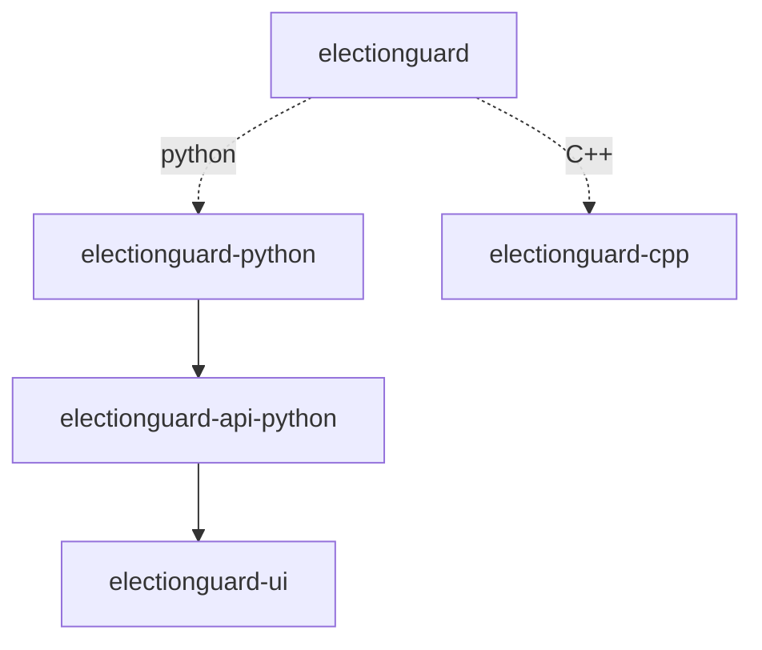
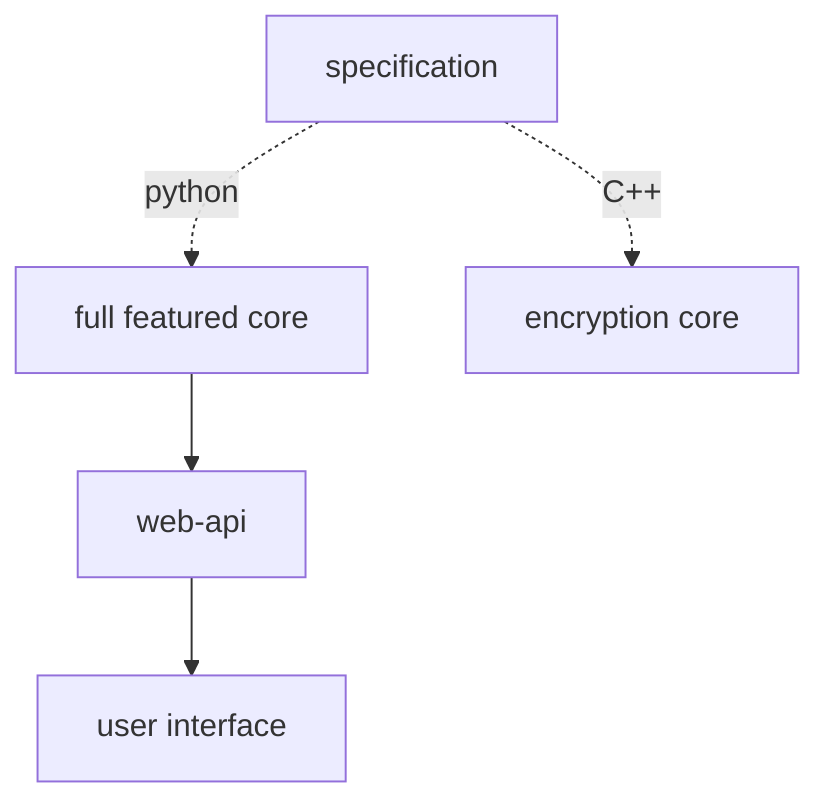

# Architecture

There are five repositories in the ElectionGuard SDK.

- [ElectionGuard Specification][election-guard-specification]
- [ElectionGuard Python][election-guard-python-source]
- [ElectionGuard C++][election-guard-cpp-source-code]
- [ElectionGuard Python API][election-guard-web-api-source]
- [ElectionGuard React UI][election-guard-ui-source]

This chart shows the relationship of the specification to the reference implementations by repository. This paints the picture of how each repository is related to each other.  

Using more plain language, the specification is the guide used to create the core repositories. There are two main paths within the core reference implementations of ElectionGuard. At the base, one is written in python and one is written in C++. These can used together, but have different feature sets.  

The python reference implementation is full featured including all elements of the specification to showcase ElectionGuard to its fullest. The C++ reference implementation is designed for smaller builds specifically focusing on encrypting ballots. 

| Feature           | `electionguard-python` |  `electionguard-cpp` |
| ----------------- | :--------------------: | :------------------: |
| Ballot Encryption | :material-check:       | :material-check:     |
| Ballot Decryption | :material-check:       |                      |
| Key Generation    | :material-check:       |                      |
| Key Ceremony      | :material-check:       |                      |
| Tally Ceremony    | :material-check:       |                      |
| Tally Decryption  | :material-check:       |                      |

## Python Stack

The python reference implementation is full featured including all elements of the specification to showcase ElectionGuard to its fullest. There are many different approaches and entry points a developer could use when starting here. Some of these are highlighted in the [applications][application-paths] list.

There is a full stack provided for python so there are many different approaches for building a stack. 

### Suggested Approaches

**Approach 1:** Build a python app utilizing `electionguard-python` package

**Approach 2:** Utilize `election-api-python` as API and integrating `electionguard-ui`'s api client into a web app.

**Approach 3:** Utilize `election-api-python` as API with a web app directly consuming api.

**Approach 4:** Utilize `electionguard-api-python` and fork `electionguard-ui`'s web apps

## C++ Stack

For the C++ stack, the goal of a developer should be ballot encryption that might be present for an encryption device. The ballot encryption app description can be seen in the [applications][application-encryption] list.

### Suggested Approaches

**Approach 1:** Use C++ directly

**Approach 2:** Use Nuget Package

[application-paths]: ../Applications/#paths
[application-encryption]: ../Applications/#ballot-encryption
[election-guard-specification]: https://github.com/microsoft/electionguard "Election Guard Github"
[election-guard-python-source]: https://github.com/microsoft/electionguard-python "Election Guard Python source code"
[election-guard-cpp-source-code]: https://github.com/microsoft/electionguard-cpp/ "Election Guard C++ source code"
[election-guard-web-api-source]: https://github.com/microsoft/electionguard-api-python "Election Guard Web API source code"
[election-guard-ui-source]: https://github.com/microsoft/electionguard-ui "Election Guard UI source code"