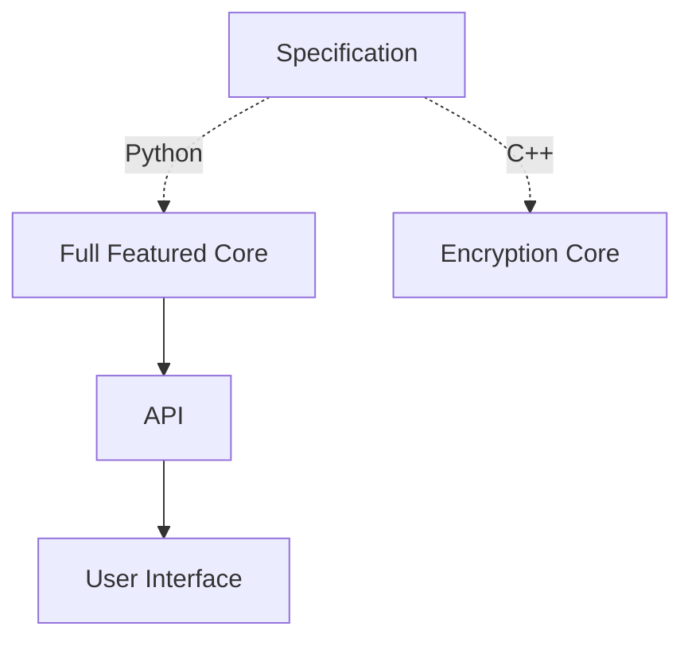

# Architecture

There are five official repositories in the **ElectionGuard SDK**.

- [ElectionGuard Specification][election-guard-specification]
- [ElectionGuard Python][election-guard-python-source]
- [ElectionGuard C++][election-guard-cpp-source-code]
- [ElectionGuard Python API][election-guard-web-api-source]
- [ElectionGuard React UI][election-guard-ui-source]

The **ElectionGuard Specification** repository focuses on explaining ElectionGuard as a whole including documentation and the specification itself. The other repositories are all reference implementations. These reference implementations are designed to demonstrate to developers how to implement a system using the ElectionGuard Specification. In depth descriptions of the repositories are detailed in the [repositories][repositories] page.

## Cores

An **ElectionGuard Core** is a code base that implements fundamental features of the ElectionGuard Specification (such as ballot encryption) to act as a core or central integration. ElectionGuard provides two official reference implementations of Cores: Python and C++. The **Python Core** (`electionguard-python`) is full featured including all elements of the specification to showcase ElectionGuard to its fullest. The **C++ Core** (`electionguard-cpp`) is designed with a focus on encrypting ballots. Its goal is to allow developers to use the ElectionGuard encryption on encryption devices.

| Feature           | `electionguard-python` |  `electionguard-cpp` |
| ----------------- | :--------------------: | :------------------: |
| Ballot Encryption | :material-check:       | :material-check:     |
| Ballot Decryption | :material-check:       |                      |
| Key Generation    | :material-check:       |                      |
| Key Ceremony      | :material-check:       |                      |
| Tally Ceremony    | :material-check:       |                      |
| Tally Decryption  | :material-check:       |                      |

## Paths

The specification serves as the guide to implement any ElectionGuard Core. For the official reference implementations, there are two main paths within the reference implementations of ElectionGuard. One path starts with the Python Core (`electionguard-python`) and the other starts with C++ Core (`electionguard-cpp`). These paths can used together, but have different feature sets.

This chart shows the relationship of the specification to the reference implementations by repository name. This paints the picture of how the repositories are related to each other.  

### Python Path

The Python path is full featured including all elements of the specification to showcase ElectionGuard to its fullest. There is a full stack provided for Python so there are many different approaches and entry points a developer could use when starting here. The following suggested approaches can be used to develop apps like those listed in the [applications][application-paths] list.

#### Suggested Approaches

- Build a custom Python app with `electionguard-python` package

- Build a custom web app and use `electionguard-api-python` as an API

- Build a custom web app with `electionguard-ui`'s api client and use `electionguard-api-python` as an API.

- Build a custom web app from fork of `electionguard-ui`'s web apps and use `electionguard-api-python` as an API

### C++ Path

For the C++ path, the included reference implementation of a C++ Core and resulting packages are currently designed with a focus on encrypting ballots. Its goal is to allow developers to use ElectionGuard encryption on encryption devices. The following suggested approaches can be used to develop a ballot encryption app or integration as described in the [applications][application-encryption] list.

#### Suggested Approaches

- Build custom app linking C++ library

- Build custom app and use NuGet Package

[repositories]: ../Repositories
[application-paths]: ../Applications/#paths
[application-encryption]: ../Applications/#ballot-encryption
[election-guard-specification]: https://github.com/microsoft/electionguard "Election Guard Github"
[election-guard-python-source]: https://github.com/microsoft/electionguard-python "Election Guard Python source code"
[election-guard-cpp-source-code]: https://github.com/microsoft/electionguard-cpp/ "Election Guard C++ source code"
[election-guard-web-api-source]: https://github.com/microsoft/electionguard-api-python "Election Guard Web API source code"
[election-guard-ui-source]: https://github.com/microsoft/electionguard-ui "Election Guard UI source code"