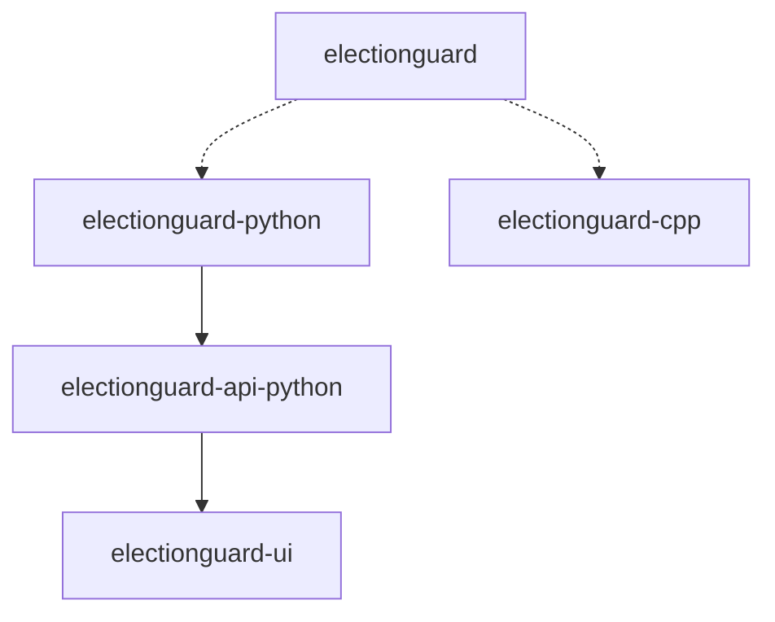
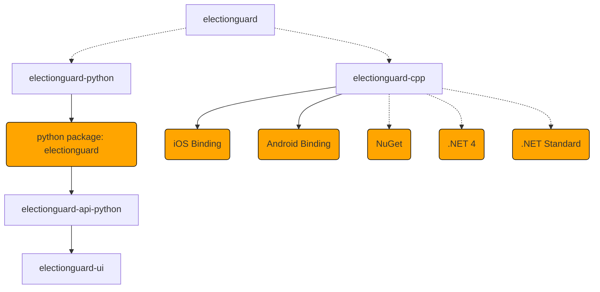

# Architecture

## Basic

```mermaid
graph TD
    electionguard -.-> electionguard-python
    electionguard-python --> electionguard-api-python
    electionguard-api-python --> electionguard-ui

    electionguard -.-> electionguard-cpp
```

## With Packaging

```mermaid
graph TD
    electionguard -.-> electionguard-python
    electionguard-python --> pypi
    pypi(python package: electionguard):::package --> electionguard-api-python
    electionguard-api-python --> electionguard-ui

    electionguard -.-> electionguard-cpp
    electionguard-cpp --> ios(iOS Binding):::package
    electionguard-cpp --> Android(Android Binding):::package
    electionguard-cpp -.-> NuGet(NuGet):::package
    electionguard-cpp -.-> Net4(.NET 4):::package
    electionguard-cpp -.-> NetStandard(.NET Standard):::package

    classDef package fill: orange, stroke: black;
```