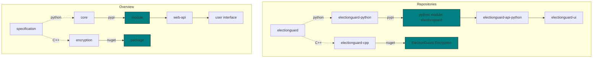

# Repositories

The SDK is comprised of five repositories:

- [ElectionGuard Specification](https://github.com/microsoft/electionguard)
- [ElectionGuard Python](https://github.com/microsoft/electionguard-python)
- [ElectionGuard C++](https://github.com/microsoft/electionguard-cpp)
- [ElectionGuard Python API](https://github.com/microsoft/electionguard-api-python)
- [ElectionGuard React UI](https://github.com/microsoft/electionguard-ui)

## Diagrams

