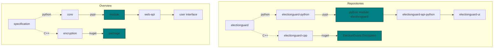

# Repositories

The SDK is comprised of five repositories:

- [ElectionGuard Specification][election-guard-specification]
- [ElectionGuard Python][election-guard-python-source]
- [ElectionGuard C++][election-guard-cpp-source-code]
- [ElectionGuard Python API][election-guard-web-api-source]
- [ElectionGuard React UI][election-guard-ui-source]

![Code][code-image]

## Diagrams

<!-- Links -->
[election-guard-specification]: https://github.com/microsoft/electionguard "Election Guard Github"
[election-guard-python-source]: https://github.com/microsoft/electionguard-python "Election Guard Python source code"
[election-guard-cpp-source-code]: https://github.com/microsoft/electionguard-cpp/ "Election Guard C++ source code"
[election-guard-web-api-source]: https://github.com/microsoft/electionguard-api-python "Election Guard Web API source code"
[election-guard-ui-source]: https://github.com/microsoft/electionguard-ui "Election Guard UI source code"
[code-image]: ../images/undraw/code_2.svg "Image of two people using their laptops"
