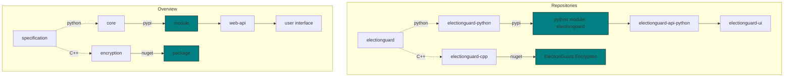

# Introduction

## What is ElectionGuard?

ElectionGuard comprises a software development kit for builders of election systems to add end-to-end election verifiability capability, or for election administrations to publish post-election audits.

## Where to start?

There are many ways to adopt or contribute to ElectionGuard. It is an open source platform and depends on an active community and ecosystem.

The ElectionGuard SDK comprises five Github repos:

- [**ElectionGuard Specification**](https://github.com/microsoft/electionguard)
- [**ElectionGuard Python**](https://github.com/microsoft/electionguard-python)
- [**ElectionGuard C++**](https://github.com/microsoft/electionguard-cpp)
- [**ElectionGuard Python API**](https://github.com/microsoft/electionguard-api-python)
- [**ElectionGuard React UI**](https://github.com/microsoft/electionguard-ui)

Whenever possible and as a guiding principle, the evolution of the ElectionGuard SDK will be driven by the use cases and priorities of the community and in service of best-practice implementations of real-world, secret-ballot public elections.

### Ways to get involved

1. Learn about ElectionGuard and share the information
2. Post questions or ideas in our [**discussion board**](https://github.com/microsoft/electionguard/discussions)
3. Join our [**weekly video office hours**](https://github.com/microsoft/electionguard/discussions/61)
4. Develop on issues in the repos with tags of **`good first issue`** or **`help wanted`**
