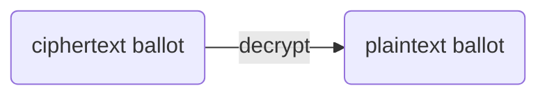
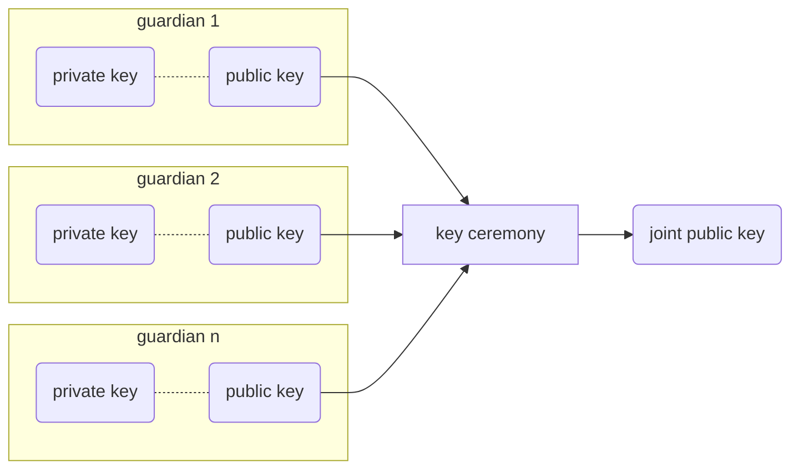
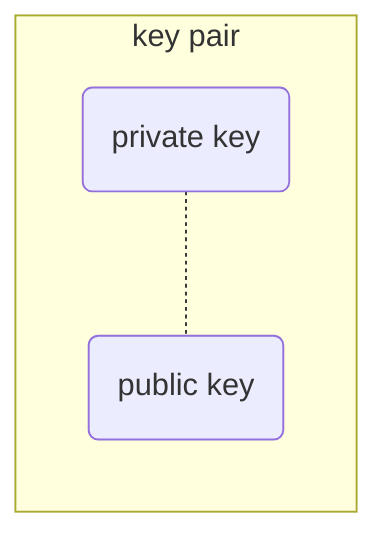
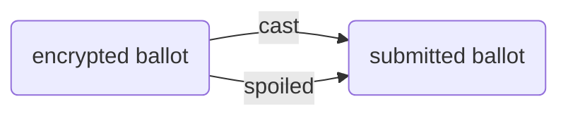

# ElectionGuard Glossary

## Overview

This glossary is intended to provide terms that are applicable to a variety of audiences:

1. **Election administrators** - Terms that map to their conception of the voting process and user experience
2. **Developers** - Provides entities, constructs, and a detailed grammar that allows them to solve problems quickly
3. **Cryptographers & election technology contributors** - Consistency of usage between the specification and programming code, and sufficiently clear descriptions of the techniques and terms necessary for proper treatment and interpretation of the election record and all processes
4.  **General public** - Clear articulation of the meaning and rationale for the different facets of end-to-end verifiability

!!! Info
    ElectionGuard seeks to keep most terms and meanings consistent the [NIST Election Results Common Data Format Specification][nist-data-format] and the [Civics Common Standard Data Specification][civics-data-format]. These can be helpful additions to this glossary.

---------------

## Terms

_Utilize the search bar to ease searching for a particular terms. There are "other terms" sections to reduce the difficulty to search possible outdated or deprecated terms._

### approval voting

Approval voting is a single-winner electoral system where each voter may choose or approve any number of [candidates](#candidate), and the winner is the single candidate approved by the largest number of voters. Approval voting can be achieved by setting the [selection limit](#selection-limit) to the total number of options in a [contest](#contest). 

### auxiliary key pair

A [key pair](#key-pair) owned by a specific [guardian](#guardian) for encryption to securely send information to other guardians.

###### _Other terms:_ auxiliary keys

### ballot box

A term used to represent collection of submitted ballots in programming code mimicking the physical item.

### ballot chain

If the ballots are encrypted in a particular order by an [encryption device](#encryption-device), this creates a ballot chain. This can be useful for verification purposes because an inserted or removed ballot can be easily detected as a break in the chain.

### ballot code

A unique hash value generated by an [encryption device](#encryption-device) to anonymously identify a ballot and allow the voter to confirm the ballot has been submitted. code is not to be confused with _programming code_, but is rather a code to confirm the ballot.

###### _Other terms:_ code, confirmation code, ballot confirmation code, verification code _(deprecated)_

### ballot decryption

Decrypting a secure encrypted [ciphertext ballot](ciphertext-ballot) to a readable [plaintext ballot](plaintext-ballot).

### ballot encryption

Encrypting a readable [plaintext ballot](#plaintext-ballot) to a secure encrypted [ciphertext ballot](#ciphertext-ballot).

### ballot lifecycle

The lifecycle the ballot goes through. For ElectionGuard, the ballot goes from a [plaintext ballot](#plaintext-ballot) to a [ciphertext ballot](#ciphertext-ballot) to a submitted ballot and then it is either (1) cast, added to tally or (2) spoiled and decrypted during tally ceremony. 

### candidate

A candidate is a choice or option on a [contest](#contest). This can represent a named a named candidate but also word choices like yes or no. 

###### _Other terms:_ choice, option

### cast ballot

A ballot which a voter has submitted as cast to be included in the official election [tally](#plaintext-tally).

###### _Other terms:_ cast, casting

### ciphertext ballot

An encrypted representation of a voter's [filled-in ballot](#plaintext-ballot).

###### _Other terms:_ encrypted ballot

### ciphertext election context

The cryptographic context of an election constructed following the [key ceremony](#key-ceremony). This is a programming concept to coordinate the cryptographic information about the election such as the number of guardians and [quorum](#quorum), and [joint key](#joint-key).

###### _Other terms:_ election context, context

### ciphertext tally

A ciphertext tally is the homomorphically-combined and encrypted representation of all selections made for each option on every contest in the election. It is an aggregate of all the encrypted [cast ballots](#cast-ballot) in the election. The ciphertext tally is the tally while it is is still in the encrypted state.

###### _Other terms:_ aggregate ciphertext ballot

### compact ballot

A compact ballot is an ElectionGuard term for an encrypted or plaintext ballot that contains only the basic information for a ballot to allow for faster performance and smaller data size. The compact ballot saves space by removing information that can be reconstituted like contest info from the manifest or mathematical proofs. 

### compensated decryption share

A partial decryption share value computed by an available guardian to compensate for a missing guardian so that the missing guardian's share can be generated and the [tally](#plaintext-tally) can be successfully decrypted.

### contest

A contest in an [manifest](#manifest) consists of a set of [candidates or options](#candidate) together with a [selection limit](#selection-limit). Contests can be customized to suit the voting experience with options like [approval voting](#approval-voting), [ranked-choice voting](#ranked-choice-voting) and [write-ins](#write-in). Contests can have special rules around selection limits to handle [undervotes](#undervote), [overvotes](#overvote), and [null votes](#null-vote).

### decryption share

A [guardian's](#guardian) partial share of a [ballot decryption](#ballot-decryption) or [tally decryption](#ballot-decryption).

### election

An election in ElectionGuard is an election as described by a [manifest](#manifest). An election will have one [encryption key](#encryption-key) to encrypt ballots and after tally, will result in an [election record](#election-record).

### election key pair

A [key pair](#key-pair) owned by a specific [guardian](#guardian) for joint encryption in combination with the other guardians to secure the election.

###### _Other terms:_ election keys, guardian key pair, guardian keys

### election partial key backup

A point on a secret [election polynomial](#election-polynomial) and commitments to verify this point for a designated guardian.

###### _Other terms:_ backup

### election partial key verification

A [guardian's](#guardian) verification that a received [election partial key backup](#election-partial-key-backup) is valid to ensure decryption can occur with missing guardians in the tally ceremony.

###### _Other terms:_ backup verification

### election polynomial

The election polynomial is the mathematical expression that each [guardian](#guardian) uses for encryption. Each guardian has a polynomial where the first coefficient is used to generate their [election key pair](#election-key-pair). A different point associated with the polynomial is shared with each of the other guardians in the [key ceremony](#key-ceremony) so that the guardians can come together and decrypt in the [tally ceremony](#tally-ceremony).

### election record

A verifiable record of the public artifacts or files of the election. This includes items like the manifest and the encrypted ballots so an individual or third party can verify the election end-to-end.

###### _Other terms:_ record, election artifacts _(deprecated)_

### ElectionGuard Core

A programming code base that implements fundamental features of the ElectionGuard Specification (such as ballot encryption) to act as a core or central integration.

### ElectionGuard Specification

The specification indicating how ElectionGuard creates end-to-end verifiable elections. See [Specification].

### ElectionGuard SDK

The entire set of repositories associated with ElectionGuard. See [Repositories].

### encryption device

A device loaded with the [election context](#election-context) that performs [ballot encryption](#ballot-encryption).

### encryption seed

The encryption seed is the starting number or point for the encryption. The seed is usually a hash either the starting hash from the [encryption device](#encryption-device) or with a [ballot chain](#ballot-chain) the hash from the previous ballot. 

###### _Other terms:_ seed hash

### end-to-end-verifiable election

End-to-end verifiable election techniques enable individual voters to check crucial ingredients of election results – without requiring voters to trust election software, hardware, election officials, procedures, or even observers. Voters may check these ingredients themselves, place their trust in others of their choice (e.g. their preferred candidates, news media, and/or interest groups), or accept the outcome produced with the usual administrative safeguards.[^1]

An end-to-end verifiable election  must include two principle components:

- Cast as intended - _Voters_ can verify that their own selections have been correctly recorded.
- Counted as cast - _Anyone_ can verify that the recorded votes have been correctly tallied.

### guardian

One of a number of independent, trustworthy individuals who serve guardians in the election. All guardians must participate in a [key ceremony](#key-ceremony) to create a [key](#joint-key) to encrypt the election and may participate in the accompanying tally ceremony(s) to decrypt the [tally(s)](#tally). A guardian is *available* if they are available for the tally ceremony. A guardian is *missing* if they cannot attend the tally ceremony.

###### _Other terms:_ election guardian, missing guardian, available guardian

### hash

Hashing is a common practice in computing as a mechanism to map data of an arbitrary size into a fixed-size equivalent. ElectionGuard uses hashing in its [cryptographic context][cryptographic-context], This is done for a variety of reasons, including preventing discovery of election ballot contents, but also to verify certain information. For example, a hash of the manifest is added to the ballot which can verify the ballot is using the correct manifest.

### joint key

A public encryption key which is the combination the public key of the [election key pair](#election-key-pair) of each of the [guardians](#guardian). This key is created as the last step in the [key ceremony](#key-ceremony).

_Creating a joint public key as part of the key ceremony_

###### _Other terms:_ joint public key, encryption key, ballot encryption key, elgamal key

### key ceremony

The process conducted at the beginning of the election to create the [joint key](#joint-key) for [ballot encryption](#ballot-encryption) during the election. In ElectionGuard, each [guardian](#guardian) creates an [election key pair](#election-key-pair) and shares a recovery method for their decryption with the other election guardians as part of the [key ceremony](#key-ceremony) in case that particular guardian cannot attend the [tally ceremony](#tally-ceremony).

### key pair

A _key pair_ consists of a linked _private key_ and _public key_. Key pairs are used in [public key cryptography][cryptographic-context], in which public keys are distributed to others to [encrypt](#encrypting-a-ballot) messages that only the private key can [decrypt](#decrypt).

### manifest

The manifest is the information that uniquely specifies and describes the structure and type of the election, including geopolitical units, contests, candidates, ballot styles, etc. In ElectionGuard, it is a file that is created before running an [election](#election). The internal manifest is a wrapper around the manifest used in programming code to simplify and avoid processing the same information twice. Unlike the manifest, the internal manifest is not meant for serialization.

###### _Other terms:_ election manifest, election description _(deprecated)_, internal election description _(deprecated)_

### mediator

A mediator is used to mediate communication (if needed) of information such as keys between the guardians. This can be a person but in ElectionGuard this often refers to the server mediating / coordinating between the guardian machines that maintains all the public information between the key and tally ceremonies.

###### _Other terms:_ key ceremony mediator, tally mediator

### nonce

An arbitrary number used for cryptographic applications particularly encryption.

### non-interactive-zero-knowledge proof (NIZK)

A non-interactive-zero-knowledge proof (NIZK) is a [zero-knowledge proof](#zero-knowledge-proof) that can be performed without interaction or intervention by the prover.

### null vote

An null vote occurs when no candidate is selected for a [contest](#contest). Example: A contest where 2 candidate must be selected and 0 are chosen.

### overvote

An overvote occurs when too many candidates are selected for a [contest](#contest). Example: A contest where 2 candidate must be selected and 3 are chosen.

### placeholder

A legitimate vote in a [contest](#contest) consists of a set of selections with cardinality not exceeding the [selection limit](#selection-limit) of that [contest](#contest). To accommodate legitimate [undervotes](#undervote) or [null votes](#null-vote), the internal representation of a contest in programming code is augmented with “placeholder” options equal in number to the selection limit. Placeholder options are selected as necessary to force the total number of selections made in a contest to be equal to the selection limit. When the selection limit is one, for example, the single placeholder option can be thought of as a “none of the above” option.

With larger selection limits, the number of placeholder options selected corresponds to the number of additional options that a voter could have selected in a contest.

### plaintext ballot

The plaintext representation of a voter's selections.

###### _Other terms:_ ballot

### plaintext tally

A plaintext tally is the summation of votes for each candidate for each contest in the election. The plaintext tally, or just tally, is the decrypted [ciphertext tally](#ciphertext-tally) or decrypted aggregate ballot which contains the election results.

###### _Other terms:_ aggregate ballot, tally, election results

### post-election audit

A post-election audit verifies that the voting equipment used to count ballots during an election
properly counts a sample of voted ballots after an election

### quorum

The minimum count of guardians that must be present in order to successfully decrypt the [tally](#plaintext-tally).

###### _Other terms:_ threshold

### ranked-choice voting (RCV)

A ranked-choice voting is an electoral system in which voters rank candidates by preference on their ballots. ElectionGuard does not currently support this.

### risk-limiting audit (RLA)

A risk-limiting audit is a [post-election audit](#post-election-audit) that provides strong statistical evidence that the election outcome is correct. RLA has a high probability of correcting a wrong outcome.

### selection

A selection or vote is the selected candidate(s) or option(s) in a contest on a voter's ballot.

###### _Other terms:_ ballot selection, candidate selection, vote

### selection limit

The limit of selections that indicates the number of selections that are allowed to be made in that [contest](#contest). Most contests have a selection limit of one, but a larger selection limit (e.g., select up to three) is not uncommon in certain elections. 

### sequence order

The sequence order is a field used to ensure items such as contests, selections, or guardians are in order for functions that require specific ordering. _"In sequence order"_ means ordered by increasing sequence order number.

### spoiled ballot

**Spoiling** allows a voter to turn in their ballot without their ballot being included in the election tally. A **spoiled ballot** is a ballot the voter has submitted as _spoiled_. The voter must submit a replacement ballot as their official [cast ballot](#cast-ballot).

In ElectionGuard, ballot spoiling is used as a means for voters to challenge the voting machine and force it to reveal the contents of spoiled ballots for public scrutiny. In this way, a spoiled ballot challenges the system and the term **challenge ballot** is used. The ballot is spoiled after encryption where the machine cannot modify the ballot. Since the ballot will not be used in the official tally, the content of the ballot can be revealed at the same time as the tally allowing a voter to verify the encryption and decryption process.

###### _Other terms:_ spoil, spoiling, challenge ballot

### submitted ballot

A ballot that is submitted for inclusion in the [election](#election) and is either: [cast](#cast-ballot) or [spoiled](#spoiled-ballot).

###### _Other terms:_ accepted ballot _(deprecated)_

### tally ceremony

The process of decrypting the [encrypted tally](#ciphertext-tally) to the [decrypted tally](#plaintext-tally). The guardians from the [key ceremony](#key-ceremony) who are available attend this ceremony. There must be at least enough guardians to meet the [quorum](#quorum). Each guardian will decrypt their [decryption shares](#decryption-share) and their share for each missing guardian. These shares will then be combined to create the decrypted [spoiled ballots](#spoiled-ballot) and decrypted [tally](#plaintext-tally).

### tally decryption

Decrypting an encrypted [ciphertext tally](#ciphertext-tally) to a readable [plaintext tally](#plaintext-tally) to view results. This is essentially the same concept as [ballot decryption](#ballot-decryption).

### undervote

An undervote occurs when too little candidates are selected for a [contest](#contest). Example: A contest where 2 candidate must be selected and 1 is chosen. Selecting no candidates at all will result in a [null vote](#null-vote).

### unknown ballot

An unknown ballot is a [submitted ballot](#submitted-ballot) which has not been determined to be [cast](#cast-ballot) or [spoiled](#spoiled-ballot), or that may have been spoiled but is otherwise not published in the election results.

### write-in

A write-in is a [candidate or option](#candidate) which does not appear on the [manifest](#manifest)'s [contest](#contest). For ElectionGuard, write-ins are assumed to be explicitly registered or allowed to be lumped into a single "write-ins" category for the purpose of verifiable tallying. 

### zero-knowledge proof

A zero-knowledge proof is a method by which one party (the prover) can prove to another party (the verifier) that they know a value `x`, without conveying any information apart from the fact that they know the value `x`. The essence of zero-knowledge proofs is that it is trivial to prove that one possesses knowledge of certain information by simply revealing it; the challenge is to prove such possession without revealing the information itself or any additional information.[^2]

[^1]: [End-to-end verifiability][end-to-end-verifiability]
[^2]: [Zero-Knowledge Proof from Wikipedia][zero-knowledge-proof]

<!-- Links -->
[Specification]: ../../spec
[Repositories]: ../../develop/Repositories
[nist-data-format]: https://nvlpubs.nist.gov/nistpubs/SpecialPublications/NIST.SP.1500-100r2.pdf "NIST Election Results Common Data Format Specification"
[civics-data-format]: https://developers.google.com/elections-data/reference "Civics Common Standard Data Specification"
[cryptographic-context]: https://en.wikipedia.org/wiki/Cryptographic_hash_function "Cryptographic hash function"
[end-to-end-verifiability]: https://escholarship.org/content/qt7c9994dg/qt7c9994dg_noSplash_97d64dc5a809c552701079250f47b4cb.pdf "End-to-end Verifiability"
[zero-knowledge-proof]: https://en.wikipedia.org/wiki/Zero-knowledge_proof "Zero-Knowledge Proof"
