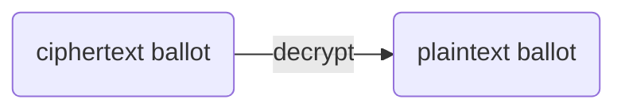
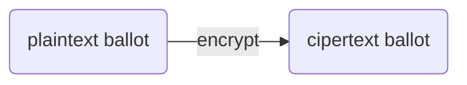
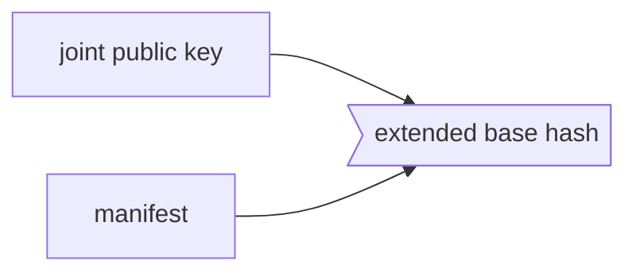
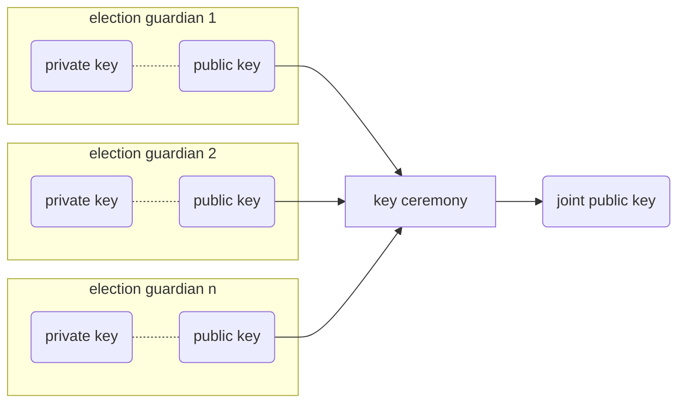
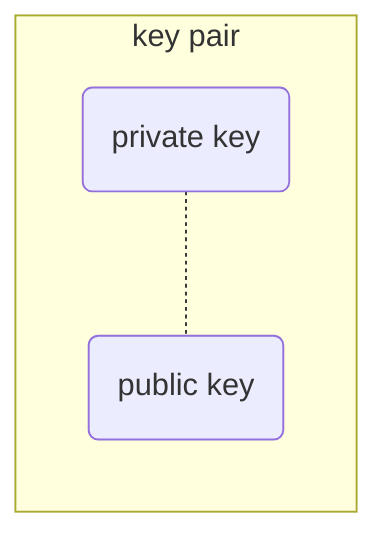
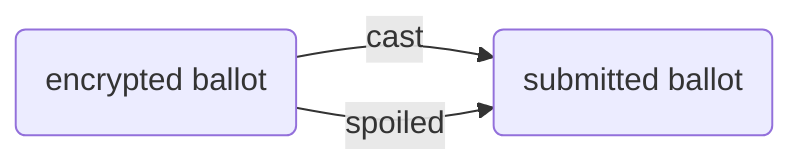

# ElectionGuard Glossary

## Overview

Software development kits (SDKs) such as ElectionGuard, by their very nature, are intended to stitch together multiple distinct actions or areas into a cohesive whole. By necessity an SDK must "speak" multiple languages so the different actors involved can understand how the SDK fits in their world.

This Glossary attempts to address its different audiences with terms and constructs appropriate to each:

- for election administrators, terms that map to their conception of the voting process and user experience;
- for developers, efficient constructs and a grammar that conveys the appropriate action to be performed and the proper state of the entity they're working with;
- for cryptographers and verifier contributors, consistency of usage between the specification and code, and sufficiently clear descriptions of the techniques and terms necessary for proper treatment and interpretation of all election record and processes; and
- for everyone, clear articulation of the meaning and rationale for the different facets of end-to-end verifiability

To illustrate what that means in practice, take one of the fundamental tenets of end-to-end verifiability: **_spoiling_**, **_challenging_**, or **_decrypting_** a ballot. Each of these words can mean the same thing sometimes but not always; it depends on the context of the usage.

So in this example:

- **_[Spoiling a ballot](#spoiled-ballot)_** is a process **election administrators** use to allow voters who make mistakes filling out a ballot to begin again with a replacement ballot; in this context, the spoil process is a physical process undertaken by poll workers to ensure the ballot with a mistake is not included in any tallies.
- **_[Challenging a ballot](#challenge-ballot)_** is the process **voters** use to challenge the integrity of the voting system by forcing it to reveal what it _would have_ submitted if the ballot were actually cast; challenged ballots are published in their **unencrypted (original, human-readable) state**
- **_[Decrypting a ballot](#decrypted-ballot)_** is the process **developers** use to reveal a ballot's unencrypted contents; **[election guardians](#election-guardians)** decrypt challenge ballots as part of the publishing process for [end-to-end-verifiable elections](#end-to-end-verifiable).

!!! Info
    Whenever possible, we used terms and meanings consistent the [NIST Elections Guide][nist-election-event-logging].

## Terms

### accepted ballot

A ballot that is accepted for inclusion in election results and is either: cast or spoiled.

### auxiliary key pair

Pair of keys (public & secret) used to encrypt/decrypt information sent between guardians. Auxiliary key pairs are used

### available guardian

A guardian that has announced as present for the decryption phase

### ballot box

A collection of ballots that have been either cast or spoiled.

### ballot chain

### ballot encryption (see [encrypting a ballot](#encrypting-a-ballot) )

### ballot lifecycle

### base hash $Q$

Represented as $Q$, the _base hash_ is the [hash](#hash) of the election

### cast ballot

A ballot which a voter has accepted as valid to be included in the official election tally.

### challenge ballot

### ciphertext ballot

An encrypted representation of a voter's filled-in ballot.

### ciphertext election context

The cryptographic context of an election that is configured during the Key Ceremony

### code (see [verification code](#verification-code))

!!! info
    _Code_ has many meanings. Code can refer to the Python and C++ repos. Code can also mean code the noun ("I'm going to look at the code") and verb ("I'm going to go code") generally. Context matters

_Code_ in the ElectionGuard context refers to the [_verification code_](#verification-code) generated by the ballot encryption process. That is _code_ _in the code libraries themselves_ is the hexadecimal string generated by the ballot encryption process.

### compact ballot

### compensated decryption share

A partial decryption share value computed by an available guardian to compensate for a missing guardian so that the missing guardian's share can be generated and the election results can be successfully decrypted.

### contest

A _contest_ in an [_election_](#election) consists of a set of options together with a selection limit that indicates the number of selections that are allowed to be made in that contest. In most elections, most contests have a selection limit of one. However, a larger selection limit (e.g., select up to three) is not uncommon in some elections. Approval voting can be achieved by setting the selection limit to the total number of options in a contest. Ranked choice voting is not supported in this version of ElectionGuard, but it may be enabled in a future version.2 Also, write-ins are assumed to be explicitly registered or allowed to be lumped into a single "write-ins" category for the purpose of verifiable tallying. Verifiable tallying of free-form write-ins may be best done with a MixNet3 design.

A legitimate vote in a contest consists of a set of selections with cardinality not exceeding the selection limit of that contest. To accommodate legitimate undervotes, the internal representation of a contest is augmented with “placeholder” options equal in number to the selection limit. Placeholder options are selected as necessary to force the total number of selections made in a contest to be equal to the selection limit. When the selection limit is one, for example, the single placeholder option can be thought of as a “none of the above” option.

With larger selection limits, the number of placeholder options selected corresponds to the number of additional options that a voter could have selected in a contest.

### decrypting a ballot

A

### decrypting a tally

### decryption mediator

A component or actor responsible for composing each guardian's partial decryptions or compensated decryptions into the plaintext tally

### decryption share

A guardian's partial share of a decryption

### description hash (_preferred:_ [base hash](#base-hash-q))

A hash representation of the original [election description](#election-description----see-election-manifest)

### election

### election description

The _election description_ is the election metadata that describes the structure and type of the election, including geopolitical units, contests, candidates, ballot styles, etc. A subset of this data, the [manifest](#manifest) is encrypted with the [joint public key](#joint-key) generated by the [key ceremony](#key-ceremony) conducted by the [election guardians](#guardian) to generate the [extended base hash](#extended-base-hash-overlineq) that will be used to uniquely associate an encrypted ballot with a specific election.

### election guardian

One of a number of independent, trustworthy individuals who as part of serving as an _election guardian_ in an [end-to-end verifiable election](#end-to-end-verifiable-election) participate in a [key ceremony](#key-ceremony) to create a [joint public election key](#joint-key) and perform a [tally](#tally)

### election manifest (see [manifest](#manifest))

### election partial key backup

A point on a secret polynomial and commitments to verify this point for a designated guardian.

### election polynomial

The _election polynomial_ is the mathematical expression that each Guardian defines to solve for his or her private key. A different point associated with the polynomial is shared with each of the other guardians so that the guardians can come together to derive the polynomial function and solve for the private key.

### encrypt

### encrypted ballot metadata

A specific subset of election metadata

### encrypted tally

The homomorphically-combined and encrypted representation of all selections made for each option on every contest in the election.

### encrypting a ballot

As outlined in the ElectionGuard Specification

### encryption device

The device that is doing the encryption

### end-to-end-verifiable election

An election is [end-to-end verifiable][election-guard-verifiability][^f1] if:

- **_Cast as intended_** -- _voters_ can verify that their own selections have been correctly recorded.
- **_Counted as cast_** -- _anyone_ can verify that the recorded votes have been correctly tallied.

### extended base hash $\overline{Q}$

### guardian (see [election guardian](#election-guardian))

### hardware security module (hsm)

### hash

_Hashing_ is a common practice in computing; ElectionGuard uses hashing in its [cryptographic context](https://en.wikipedia.org/wiki/Cryptographic_hash_function), a mechanism to map data of an arbitrary size into a fixed-size equivalent. This is done for a variety of reasons, including preventing discovery of election ballot contents.

### internal election description

!!! failure "Deprecated"
    this term is deprecated and replaced with [manifest](#election-manifest)

The subset of the [election description](#election-description----see-election-manifest) required by ElectionGuard and combined with the [joint public key](#joint-key) to create the [extended base hash](#extended-base-hash-overlineq) used at the instantiation of the [encrypted ballot](#encrypting-a-ballot) [ballot chain](#ballot-chain) ballots are correctly associated with an election. This component mutates the state of the Election Description.

### joint public key

Combined public key generated by the [key ceremony](#key-ceremony) of the election guardians. Each election guardian creates their own public-private [key pair](#key-pair) and shares the public key with the other guardians. The output of the ceremony is the _joint public key_ used by voting devices to [encrypt ballots](#encrypting-a-ballot).

**_Creating a joint public key as part of the key ceremony_**

### key ceremony

The process conducted at the beginning of the election to create the joint encryption context for encrypting ballots during the election.

### key ceremony mediator

A mediator to mediate communication (if needed) of information such as keys between the guardians

### key pair

A _key pair_ consists of a linked _private key_ and _public key_. Key pairs are used in [public key cryptography][cryptographic-context], in which public keys are distributed to others to [encrypt](#encrypting-a-ballot) messages that only the private key can [decrypt](#decrypt). In ElectionGuard, each [election guardian](#election-guardian) that is part of an election creates a public-private key pair and shares their private key with the other election guardians as part of the [key ceremony](#key-ceremony)

### manifest

The _manifest_ is a subset of the [election description](#election-description) that uniquely specifies an election. It is combined with the [joint public key](#joint-key) to create the [extended base hash](#extended-base-hash-overlineq) used to instantiate a voting device to [encrypt ballots](#encrypting-a-ballot)

### master nonce

A mediator to mediate communication (if needed) of information such as keys between the guardians

### missing guardian

A guardian who was configured during the Key Ceremony but who is not present for the decryption of the election results.

### nonce

A random number used to derive encryptions

### NIZK (see [non-interactive-zero-knowledge proof](#non-interactive-zero-knowledge-proof))

### non-interactive-zero-knowledge proof

A _zero-knowledge proof_ is a method by which one party (the prover) can prove to another party (the verifier) that they know a value $x$, without conveying any information apart from the fact that they know the value $x$. The essence of zero-knowledge proofs is that it is trivial to prove that one possesses knowledge of certain information by simply revealing it; the challenge is to prove such possession without revealing the information itself or any additional information.[^nizk]

A _non-interactive-zero-knowledge proof_ (NIZK) is a zero-knowledge proof that can be performed without interaction or intervention by the prover.

ElectionGuard uses four different types of NIZK to enable ElectionGuard to demonstrate:

- keys are properly chosen
- ballots are properly formed
- decryptions match claimed values

### plaintext ballot

The plaintext representation of a voter's selections

### post-election audit

A post-election audit is

### $Q$ --see [Base hash](#base-hash-q)

The _base hash_ is the _hash_ of the [election manifest](#election-manifest) metadata

### $\overline{Q}$ --see [Extended base hash](#extended-base-hash-barq)

### quorum

The minimum count (_threshold_) of guardians that must be present in order to successfully decrypt the election results.

### spoiled ballot

A _spoiled ballot_ is an election term that refers to a ballot that, typically due to a mistake, allows a voter to turn in their ballot and instead submit a replacement ballot as their official [**cast ballot**](#cast-ballot). In this context, _spoiling_ is the process election administrators use to make sure this ballot is not included in the election tally.

Ballot spoiling is used in [_end-to-end verifiability_][election-guard-verifiability] as a means for voters to challenge the voting machine and force it to reveal the contents of spoiled ballots for public scrutiny. Because the ballot will not be used in the official tally, its contents can be revealed. And because the spoil process happens after ballot encryption, the machine cannot modify the encrypted ballot retrospectively without revealing its attempt.

### submitted ballot

A _submitted ballot_ is an encrypted ballot that has been [cast](#casting-a-ballot) or spoiled

### tally ceremony

### undervote

An **_undervote_** in a **[contest](#contest)** or **[election](#election)**

### unknown ballot

An _unknown ballot_ is a [submitted ballot](#submitted-ballot) which has not been determined to be [cast](#cast-ballot) or [spoiled](#spoiled-ballot), or that may have been spoiled but is otherwise not published in the election results.

### verification code

A unique hash value generated by an Encryption Device to anonymously identify a ballot

[^f1]: See also [End-to-end Verifiability][end-to-end-verifiability]
[^nizk]: From Wikipedia ([Zero-Knowledge Proof][zero-knowledge-proof]

<!-- Links -->
[nist-election-event-logging]: https://pages.nist.gov/ElectionEventLogging/index.html "NIST Election Event Logging Common Data Format Specification"
[cryptographic-context]: https://en.wikipedia.org/wiki/Cryptographic_hash_function "Cryptographic hash function"
[end-to-end-verifiability]: https://escholarship.org/content/qt7c9994dg/qt7c9994dg_noSplash_97d64dc5a809c552701079250f47b4cb.pdf "End-to-end Verifiability"
[zero-knowledge-proof]: https://en.wikipedia.org/wiki/Zero-knowledge_proof "Zero-Knowledge Proof"

[election-guard-verifiability]: ../concepts/Verifiability.md "Election Guard Verifiability"